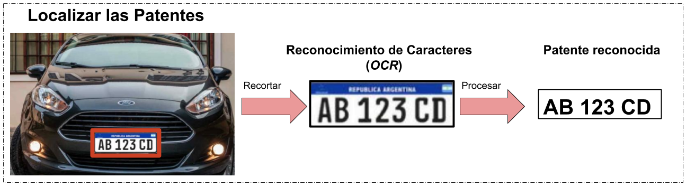

# ConvALPR

[](https://github.com/ankandrew/ConvALPR/actions)
[](https://github.com/astral-sh/ruff)
[](https://github.com/pylint-dev/pylint)
[](http://mypy-lang.org/)
[](https://pypi.python.org/pypi/fast-plate-ocr)

[](https://youtu.be/-TPJot7-HTs?t=652)

**ConvALPR** es un Reconocedor Automatico de Patentes Vehiculares, que utiliza **Redes Neuronales Convolucionales**. A
diferencia de metodos tradicionales, este approach puede reconocer patentes con obstrucciones/diferencia de
brillo/letras borrosas, etc. ConvALPR consiste de dos procesos: **localizar** (detector de objetos) y **reconocedor** (
Reconocimiento Optico de Caracteres). Ambas usan solamente **Redes Convolucionales/ConvNets/CNNs**.



## Localizador


Para el **localizador** se usa yolo
v4 **[tiny](https://github.com/AlexeyAB/darknet#yolo-v4-v3-and-v2-for-windows-and-linux)**, para lograr que el detector
corra en **tiempo real**. Este detector de objetos se entreno con patentes (ni una sola de Argentina) aun asino tiene
problemas en localizarlas con alta precision. Mas detalles de entrenamiento del
detector **[aca](https://github.com/ankandrew/LocalizadorPatentes)**. Se convirtieron los parametros de framework
Darknet a TensorFlow usando este **[repo](https://github.com/hunglc007/tensorflow-yolov4-tflite)**.

En este repo se pueden encontrar **3** versiones del localizador de patentes, misma arquitectura (**yolo v4 tiny sin
spp**), pero con distinta resolucion de entrada. Los modelos usan res. de entrada de {*384x384*, *512x512*, *608x608*},
donde a mayor la resolucion **mayor es la precision** (y puede detectar mejor patentes alejadas) pero mayor es el tiempo
de inferencia (es **mas lento**). Estos modelos se encuentran [`alpr/models/detection`](alpr/models/detection)

## Reconocedor (ROC/OCR)


Para el **reconocedor de caracteres** [OCR](https://es.wikipedia.org/wiki/Reconocimiento_%C3%B3ptico_de_caracteres) de
las patentes, se diseñaron unos modelos personalizados en TensorFlow Keras.

En este repositorio se pueden encontrar los mismos modelos que [aca](https://github.com/ankandrew/cnn-ocr-lp).

## Como usarlo

### Instalar dependencias

Con python **3.x**:

```
pip install .
```

Para correr con la **placa de video/GPU** y acelerar la inferencia, instalar
estos **[requerimientos](https://www.tensorflow.org/install/gpu#software_requirements)**.

### Visualizar solo localizador

Para probar el **localizador/detector** de patentes (**sin OCR, solo los bounding boxes**) y visualizar las predicciones
se usa el comando:

```
python detector_demo.py --fuente-video /path/a/tu/video.mp4 --mostrar-resultados --input-size 608
```

*Intenta con los distintos modelos {608, 512, 384} para ver cual se ajusta mejor a tu caso*

## Reconocedor Automatico

### Config

La **configuracion** del [ALPR](https://es.wikipedia.org/wiki/Reconocimiento_autom%C3%A1tico_de_matr%C3%ADculas) se
puede encontrar en [`config.yaml`](config.yaml). Este contiene los ajustes del Reconocedor y Localizador. Las distintas
opciones estan descriptas en el mismo archivo (que hacen). El modelo de OCR es **independiente** del detector de
objetos, y cualquiera deberia funcionar bien con cualquiera.

### Ejemplo visualizar ALPR

```
python reconocedor_automatico.py --cfg config.yaml --demo
```

### Guarda en Base de Datos sin visualizar

```
python reconocedor_automatico.py --cfg config.yaml
```

## Python API

Para usarlo en tu proyecto podes leer de config o cread un dict, es lo mismo:

### Forma #1 (cfg)

```python
from alpr.alpr import ALPR
import cv2
import yaml

im = cv2.imread('assets/prueba.jpg')
with open('config.yaml', 'r') as stream:
    cfg = yaml.safe_load(stream)
alpr = ALPR(cfg['modelo'])
predicciones = alpr.predict(im)
print(predicciones)
```

### Forma #2 (dict)

```python
from alpr.alpr import ALPR
import cv2

im = cv2.imread('assets/prueba.jpg')
alpr = ALPR(
    {
        'resolucion_detector': 512,
        'confianza_detector': 0.25,
        'numero_modelo_ocr': 2,
        'confianza_avg_ocr': .4,
        'confianza_low_ocr': .35
    }
)
predicciones = alpr.predict(im)
print(predicciones)
```

### Notas

* **Aclaracion**: Si bien el **localizador** funciona para patentes de cualquier pais el **reconocedor** actual esta
  hecho especialmente para **Argentina**,
  si queres **entrenar uno [personalizado](https://github.com/ankandrew/cnn-ocr-lp/wiki/Entrenamiento)**

* *Este trabajo forma parte de un proyecto integrador para la Universidad*

## TODO

- [ ] Ampliar modelos OCR
- [ ] Compilar para EdgeTPU
- [ ] Quantizar a FP16
- [ ] Quantizar a INT8
- [ ] Optimizar
- [ ] Aumentar `batch` de OCR
